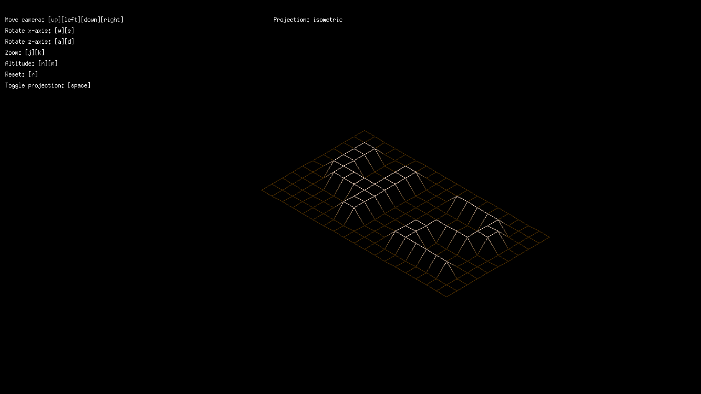
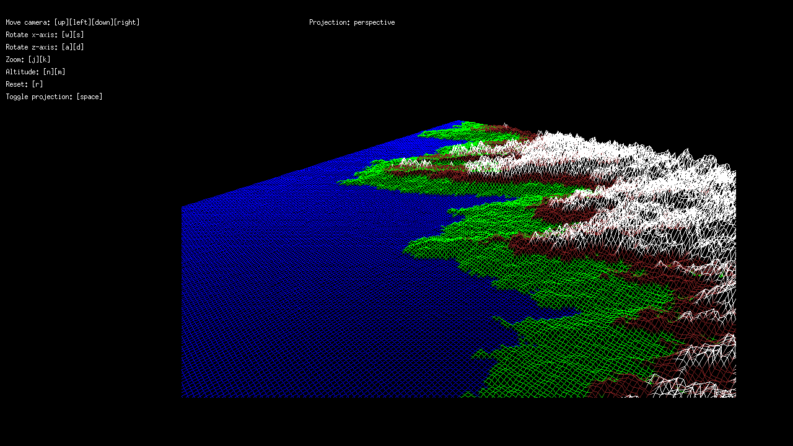

# 42-fdf
## Task
This is the first project of the graphics branch. Task is to create a program which reads a "map" file consisting of vertexes, their x, y, and z coordinates, and optionally a color.
Then I must present this map as a "wireframe" or connecting the vertexes with lines. This project must be made with the use of minilibX library. This library allows me to open up a window and coloring a pixel at specific coordinates. Everything else, like drawing a line, must be done manually.
This wireframe then must be presented with two different projections such as isometric and parallel.
## Constraints
- Only the following functions are allowed:
  - open, read, write, close
  - malloc, free,
  - exit
  - All the functions defined in the math library (-lm and man 3 math)
  - All the functions defined in the miniLibX library
## Solution
I was really interested in this project so I wanted to also handle perspective projection and smooth rotations. I used matrices to accomplish this. I created matrices for every transformation, multiplied them, and transformed each vertex before connecting them with lines.
This web page by Song Ho Ahn was invaluable for me in this project: http://www.songho.ca/opengl/gl_transform.html
## Screenshots

